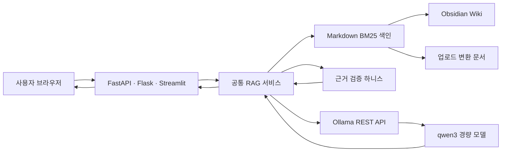
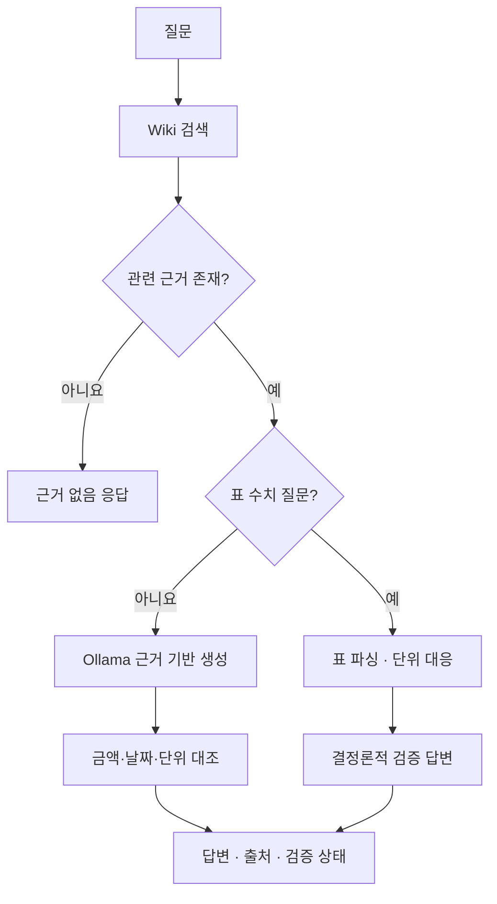

# 아키텍처

## 전체 흐름

모든 주요 연결은 `127.0.0.1` 안에서 이뤄진다. 세 프레임워크는 같은 공통 RAG 서비스를 통해 로컬 Wiki 검색과 Ollama 호출을 조정한다.

## 구성요소

### 사용자 인터페이스

`privAI.html`은 별도 프런트엔드 빌드 도구 없이 동작한다.

- 모델 선택
- 시스템 프롬프트 변경
- Wiki 근거 사용 여부
- Wiki 재색인
- MD·TXT·PDF 추가
- 답변, 출처와 검증 상태 표시

### FastAPI 서버

`app.py`는 제품의 주력 진입점이다.

- 상태·모델 API
- 일반 채팅과 RAG 채팅
- 지식 상태와 재색인
- 문서 업로드와 목록
- 요약 API
- NDJSON 응답

### 프레임워크 공통 RAG 서비스

`core/rag_service.py`는 FastAPI·Flask·Streamlit이 같은 답변 규칙을 사용하게 한다.

- Wiki 근거 검색과 출처 변환
- 근거가 없을 때 추측 차단
- 결정론적 표 답변 또는 Ollama 근거 기반 답변
- 금액·날짜·단위 검증 결과 생성
- 일반 응답과 NDJSON 이벤트 구성

Flask는 공용 `privAI.html`에 필요한 RAG·문서 API를 제공하고, Streamlit은
기본으로 `Wiki 근거 사용`을 켜서 이 서비스를 직접 호출한다.

### Ollama 클라이언트

`core/ollama_client.py`는 모든 프레임워크가 공유한다.

- 기본 주소: `http://127.0.0.1:11434`
- 컨텍스트: 2,048 tokens
- 최대 생성: 256 tokens
- temperature: 0.3
- qwen3 thinking 비활성화
- 응답시간, 생성 토큰과 token/s 측정

### 지식 검색

`core/knowledge_base.py`는 Markdown을 제목 단위로 나누고 BM25 점수를 계산한다.

1. `wiki/**/*.md`를 탐색한다.
2. Markdown 제목마다 문서 조각을 만든다.
3. 코드 블록은 예제 질문이 검색 결과를 오염시키지 않도록 제외한다.
4. 질문과 각 조각의 BM25 점수를 계산한다.
5. 검색 1위 점수의 30% 미만 결과를 제거한다.
6. 최대 5개, 기본 3개 근거를 반환한다.

현재 방식은 임베딩 모델과 벡터DB가 없어 RAM 사용과 설치 복잡도가 작다.

### 문서 처리

`core/document_ingest.py`는 다음 형식을 지원한다.

- `.md`
- `.txt` — UTF-8, UTF-8 BOM, CP949
- `.pdf` — 텍스트 레이어가 있는 PDF

검증 항목:

- 최대 5MB
- PDF 최대 100페이지
- 경로 구분자와 상위 폴더 이동 차단
- 허용 확장자 목록
- 빈 문서 차단
- 암호화 PDF와 텍스트 없는 PDF 오류 처리

변환 결과는 `wiki/Uploads/<안전한 이름>-<해시>.md`에 저장한다. 같은 내용은 같은 해시를 사용하므로 중복이 늘어나지 않는다.

### 근거 검증 하니스

`core/grounding.py`는 LLM이 근거 표나 숫자를 잘못 읽는 문제를 줄인다.

#### 결정론적 표 처리

질문에 `속도`, `시간`, `token/s`, `초`가 있으면 Markdown 표를 구조적으로 읽는다. 속도는 `token/s` 열, 시간은 시간 열에 대응하며 확정 가능한 답은 LLM을 호출하지 않는다.

#### 구조화 주장 검증

일반 RAG 답변에서 다음 값을 추출한다.

- 날짜
- 금액
- 퍼센트
- GB·MB·GHz
- token/s
- 초·분·시간
- 개수·페이지

각 값을 검색된 근거 원문과 정규화해 대조한다. 확인할 구조화 값이 없는 일반 서술문은 자동 통과시키지 않는다.

## 응답 경로

## 신뢰 경계

- 신뢰: 프로젝트 코드, 사용자가 선택한 로컬 Wiki
- 제한적 신뢰: 업로드 문서 내용, PDF 파서 출력
- 비신뢰: 모델이 생성한 모든 문장

모델 답변은 출처가 있어도 자동으로 사실이라고 간주하지 않는다. 검증 범위를 UI에서 구체적으로 구분한다.

## 저사양 설계 선택

- 벡터DB 대신 메모리 내 BM25
- 임베딩 모델 미사용
- 한 번에 모델 하나
- 컨텍스트 2,048
- 기본 검색 결과 3개
- 정적인 HTML UI
- 확정 가능한 표 수치는 LLM 호출 생략
